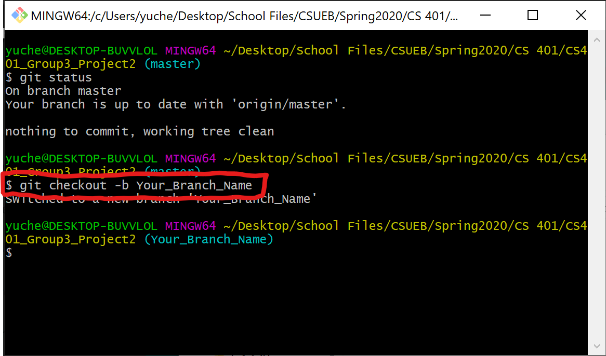

# CS401 Project2 by Group3

## Before You start
Please create a branch for yourself before working on the project

How to create a branch for git:

## Master Branch Has been updated
The current state Master Branch fulfills
- Maintain the basic functionality of AddressBook.java after modification
- additional non-GUI class and functions has been updated, which already fulfills all project 2's Further requirements as mentioned in project detail
- Data base linking method has replaced file reading method
- Menu.java is found useless but still remains for reference purpose

## What is needed
- The main GUI interface
- event handling classes
- GUI must interact with AddressBook class, for AddressBook class being the base of data holding (model)
- AddressBook class will need modification as GUI development extends
